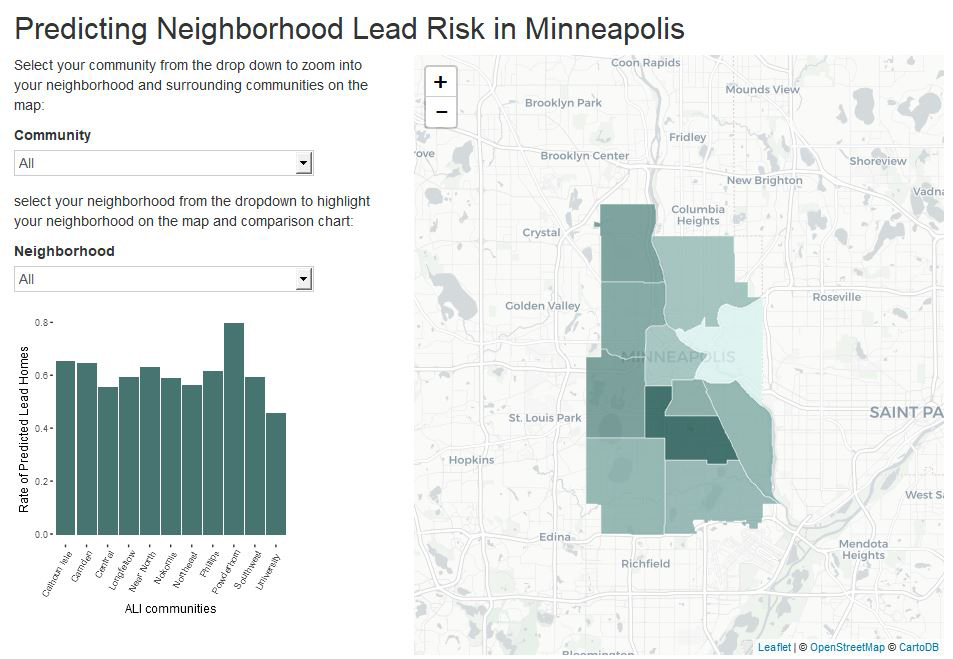
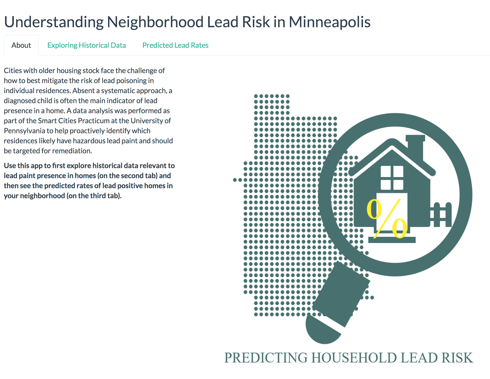

# Understanding Neighborhood Lead Risk in Minneapolis

### Data Wrangling Final Project

As part of our work for the [MUSA Practicum class](https://pennmusa.github.io/MUSA_801.io/), we performed [an analysis](ForReference_AboutOurModel) to help the City of Minneapolis to proactively identify which residences likely have hazardous lead paint and should be targeted for remediation efforts. To display our results publicly, we made a basic shiny application that displayed the outcomes of our analysis on a map to display predicted rates of lead in aggregated geographic areas. 

We wanted to use the final Data Wrangling assignment as an opportunity to flesh out this application more fully. Our aim was to create a landing page from which residents or city officials could easily access additional information depending on their interests. Those just wanting to understand their risk of household lead could jump right to the calculated lead rate compared across neighborhoods. More interested users could fully explore a range of census variables and their change in the 40 years since the ban of lead paint to see how they visually compare to instances of high lead risk. Users curious about the process for developing the risk scores could access our full explanation of the modeling process through a hyperlink, and users concerned about lead in their homes could access the webpage for the Minneapolis Lead Hazard Reduction Grant program. 

We began by restructuring our original shiny app to one with multiple tabs. The first tab became our Introduction tab which oriented the user to the site with a description of the application and an embedded logo image to visually connect this site to our Markdown webpage completed as part of the MUSA Practicum. We also created embedded hyperlinks to the Lead Program website and our full Markdown webpage. The third tab displayed the rate of lead risk per neighborhood that we included in our original MUSA Practicum application. The second tab involved more data manipulation, visualization, and embedding in the Shiny application.

To create the second tab, we then returned to data analysis, pulling historical census data from the [Brown University Longitudinal Census study](https://s4.ad.brown.edu/Projects/Diversity/Researcher/LTBDDload/DataList.aspx) which normalized data over time across changing census tracts. We manipulated this data, making a column for every relevant census variable in each year of the decennial census across tracts and joining them all into one dataset. We then mapped each census variable for each decennial census year and stitched them together into GIFs, like the one below, where every freezeframe is the choropleth map of a given census variable in a given decade. We maintained consistent legends across the freezeframes for each given variable. We also selected color palettes consistent with our overall color scheme, yet different enough to signal to the user that the map was representing a different variable. To bring this into the Shiny application, we constructed a conditional of RenderImage where a different GIF would appear to a user based on the selection they made in a dropdown of different variables. We had to resize and restructure a number of elements to ensure legibility and flow was maintained. The result is a more comprehensive web application available to users to see how demographic and housing variables related to lead presence have changed over time across the city. 

To make the web page accessible to anyone, we deployed it using ShinyApps.io, successfully debugging issues related to package masking and objects not being recognized. Please enjoy our shiny app [here](https://maureen24.shinyapps.io/app1/). 

